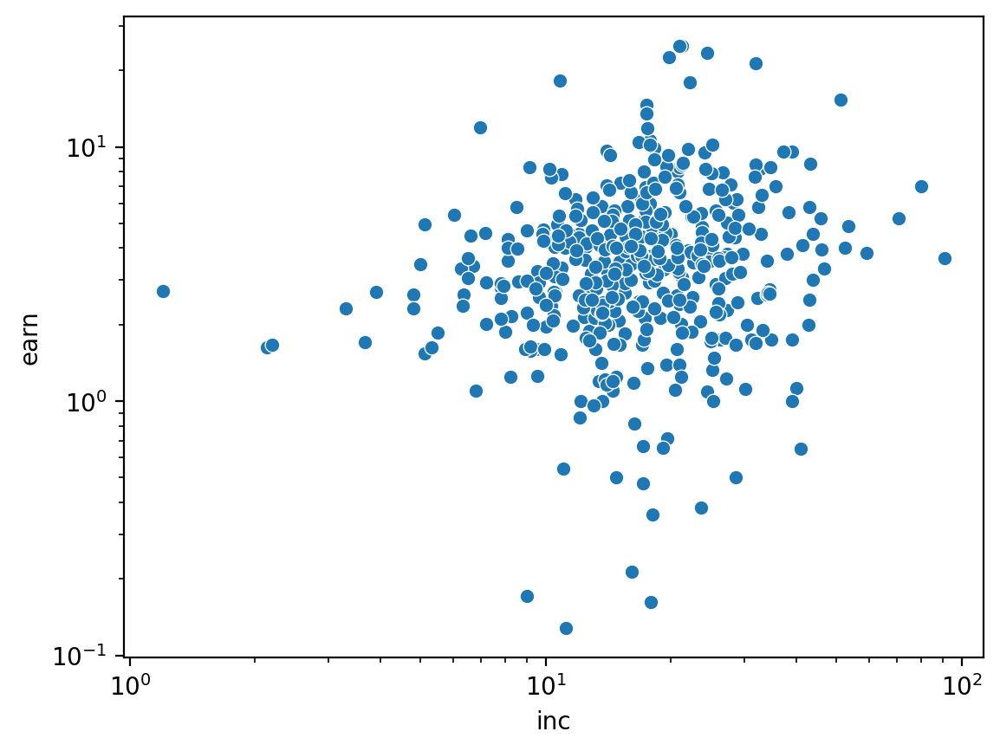
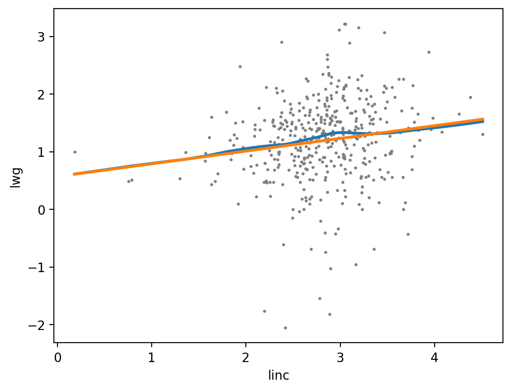

# Chapter 4. Describing Relationships

## 4.1 What is a relationship?

- generally not interested in the distribution of a single variable, but how multiple variables are related
    - by "relationship," mean what does information about one variable tell us about the other
- example data for this chapter from Emily Oster, 2020
    - goal: "do the health benefits of recommended medications look better than they actually are because already-otherwise-healthy people are more likely to follow the recommendations?"
    - "examining the relationship between taking vitamin E, other indicators of caring about your health like not smoking, and outcomes like mortality, and how those relationships change before, during, and after the time vitamin E was recommended"

## 4.2 Conditional distributions

- the distribution of one variable given information about another

## 4.3 Conditional means

- can make estimates on the conditional distributions just like on the distributions of individual variables (i.e. marginal distributions)
    - e.g. what is the average of $A$ for each category of $B$
- multiple approaches for continuous variables: binning or LOESS are common options

## 4.4 Line fitting

- a.k.a regression
- estimating the relationship of variables under some underlying shape
    - requires the user to make an assumption on the shape of the underlying relationship that could be completely wrong
- can express nonlinear relationships of variables in a linear regression by transformations of the data (e.g. $ln(x)$ or $x^2$)
- can also use a link function $F$ as in $Y = F(\beta_0 + \beta_1 X)$
    - decide on the function $F$ depending on the desired relationship between $Y$ and $X$

## 4.5 Conditional conditional means, a.k.a. "controlling for a variable"

- can think of the residual as the part of $Y$ that has nothing to do with $X$
- a process controlling for some variable $Z$:
    1. calculate the relationship of $Y$ given $Z$ and take the residual $Y^R$
    1. calculate the relationship of $X$ given $Z$ and take the residual $X^R$
    1. find the relationship between $Y$ and $X$ accounting for $Z$ by regressing $Y^R$ on $X^R$
- can accomplish this using ordinary least squares (OLS) regression, too: $Y = \beta_0 + \beta_1 X + \beta_2 Z$

## 4.6 What we're not covering

- there are more details yet to be discussed in later chapters

## 4.7 Relationships in software

- data for this book is available in the `causaldata` package

```bash
pip install causaldata
```

- some examples of loading and visualizing the data from Mroz 1987 on women's labor force participation


```python
import pandas as pd
import seaborn as sns
import statsmodels.formula.api as sm
from causaldata import Mroz
```


```python
%matplotlib inline
%config InlineBackend.figure_format='retina'
```


```python
# Read in data, keep just working women, and create unlogged earnings
dt = Mroz.load_pandas().data.drop(columns=["Unnamed: 0"])
dt = dt[dt["lfp"]].reset_index(drop=True)
dt.loc[:, "earn"] = dt["lwg"].apply("exp")
```


```python
# Draw a scatterplot
sns.scatterplot(x="inc", y="earn", data=dt).set(xscale="log", yscale="log");
```





```python
# Get the conditional mean by college attendance
# `wc` is the college variable
dt.groupby("wc")[["earn"]].mean()
```


<div>
<style scoped>
    .dataframe tbody tr th:only-of-type {
        vertical-align: middle;
    }

    .dataframe tbody tr th {
        vertical-align: top;
    }

    .dataframe thead th {
        text-align: right;
    }
</style>
<table border="1" class="dataframe">
  <thead>
    <tr style="text-align: right;">
      <th></th>
      <th>earn</th>
    </tr>
    <tr>
      <th>wc</th>
      <th></th>
    </tr>
  </thead>
  <tbody>
    <tr>
      <th>False</th>
      <td>3.583539</td>
    </tr>
    <tr>
      <th>True</th>
      <td>5.349448</td>
    </tr>
  </tbody>
</table>
</div>


```python
# Get the conditional mean by bins (cutting into 10 bins).
dt.loc[:, "inc_bin"] = pd.cut(dt["inc"], 10)
dt.groupby("inc_bin")[["earn"]].mean()
```


<div>
<style scoped>
    .dataframe tbody tr th:only-of-type {
        vertical-align: middle;
    }

    .dataframe tbody tr th {
        vertical-align: top;
    }

    .dataframe thead th {
        text-align: right;
    }
</style>
<table border="1" class="dataframe">
  <thead>
    <tr style="text-align: right;">
      <th></th>
      <th>earn</th>
    </tr>
    <tr>
      <th>inc_bin</th>
      <th></th>
    </tr>
  </thead>
  <tbody>
    <tr>
      <th>(-0.12, 9.074]</th>
      <td>3.091594</td>
    </tr>
    <tr>
      <th>(9.074, 18.177]</th>
      <td>3.826430</td>
    </tr>
    <tr>
      <th>(18.177, 27.28]</th>
      <td>4.954454</td>
    </tr>
    <tr>
      <th>(27.28, 36.383]</th>
      <td>4.563332</td>
    </tr>
    <tr>
      <th>(36.383, 45.485]</th>
      <td>4.241790</td>
    </tr>
    <tr>
      <th>(45.485, 54.588]</th>
      <td>6.139739</td>
    </tr>
    <tr>
      <th>(54.588, 63.691]</th>
      <td>3.825000</td>
    </tr>
    <tr>
      <th>(63.691, 72.794]</th>
      <td>5.232558</td>
    </tr>
    <tr>
      <th>(72.794, 81.897]</th>
      <td>7.015306</td>
    </tr>
    <tr>
      <th>(81.897, 91.0]</th>
      <td>3.666667</td>
    </tr>
  </tbody>
</table>
</div>


```python
# Draw the LOESS and linear regression curves
dt.loc[:, "linc"] = dt["inc"].apply("log")
sns.scatterplot(x="linc", y="lwg", data=dt, color="grey", s=5, edgecolor=None)
sns.regplot(x="linc", y="lwg", data=dt, lowess=True, scatter=False)
sns.regplot(x="linc", y="lwg", data=dt, ci=None, scatter=False)
```

    /usr/local/Caskroom/miniconda/base/envs/the-effect-notes/lib/python3.10/site-packages/pandas/core/arraylike.py:402: RuntimeWarning: invalid value encountered in log
      result = getattr(ufunc, method)(*inputs, **kwargs)


    <AxesSubplot: xlabel='linc', ylabel='lwg'>





```python
# 5. Run a linear regression, by itself and including controls
m1 = sm.ols(formula="lwg ~ linc", data=dt).fit()
print(m1.summary())
```

                                OLS Regression Results
    ==============================================================================
    Dep. Variable:                    lwg   R-squared:                       0.027
    Model:                            OLS   Adj. R-squared:                  0.024
    Method:                 Least Squares   F-statistic:                     11.65
    Date:                Wed, 30 Nov 2022   Prob (F-statistic):           0.000703
    Time:                        08:12:41   Log-Likelihood:                -461.34
    No. Observations:                 427   AIC:                             926.7
    Df Residuals:                     425   BIC:                             934.8
    Df Model:                           1
    Covariance Type:            nonrobust
    ==============================================================================
                     coef    std err          t      P>|t|      [0.025      0.975]
    ------------------------------------------------------------------------------
    Intercept      0.5690      0.185      3.079      0.002       0.206       0.932
    linc           0.2207      0.065      3.413      0.001       0.094       0.348
    ==============================================================================
    Omnibus:                       65.243   Durbin-Watson:                   1.947
    Prob(Omnibus):                  0.000   Jarque-Bera (JB):              163.890
    Skew:                          -0.761   Prob(JB):                     2.58e-36
    Kurtosis:                       5.626   Cond. No.                         17.1
    ==============================================================================

    Notes:
    [1] Standard Errors assume that the covariance matrix of the errors is correctly specified.


```python
# k5 is number of kids under 5 in the house
m2 = sm.ols(formula="lwg ~ linc + wc + k5", data=dt).fit()
print(m2.summary())
```

                                OLS Regression Results
    ==============================================================================
    Dep. Variable:                    lwg   R-squared:                       0.070
    Model:                            OLS   Adj. R-squared:                  0.064
    Method:                 Least Squares   F-statistic:                     10.67
    Date:                Wed, 30 Nov 2022   Prob (F-statistic):           8.92e-07
    Time:                        08:12:41   Log-Likelihood:                -451.54
    No. Observations:                 427   AIC:                             911.1
    Df Residuals:                     423   BIC:                             927.3
    Df Model:                           3
    Covariance Type:            nonrobust
    ==============================================================================
                     coef    std err          t      P>|t|      [0.025      0.975]
    ------------------------------------------------------------------------------
    Intercept      0.7065      0.184      3.833      0.000       0.344       1.069
    wc[T.True]     0.3353      0.075      4.450      0.000       0.187       0.483
    linc           0.1351      0.066      2.041      0.042       0.005       0.265
    k5            -0.0675      0.087     -0.775      0.439      -0.239       0.104
    ==============================================================================
    Omnibus:                       82.950   Durbin-Watson:                   2.001
    Prob(Omnibus):                  0.000   Jarque-Bera (JB):              253.726
    Skew:                          -0.889   Prob(JB):                     8.02e-56
    Kurtosis:                       6.332   Cond. No.                         17.6
    ==============================================================================

    Notes:
    [1] Standard Errors assume that the covariance matrix of the errors is correctly specified.


---

## Session information


```python
%load_ext watermark
%watermark -d -u -v -iv -b -h -m
```

    Last updated: 2022-11-30

    Python implementation: CPython
    Python version       : 3.10.8
    IPython version      : 8.6.0

    Compiler    : Clang 14.0.6
    OS          : Darwin
    Release     : 21.6.0
    Machine     : x86_64
    Processor   : i386
    CPU cores   : 4
    Architecture: 64bit

    Hostname: JHCookMac.local

    Git branch: master

    statsmodels: 0.13.5
    pandas     : 1.5.2
    causaldata : 0.1.3
    seaborn    : 0.12.1


```python

```
